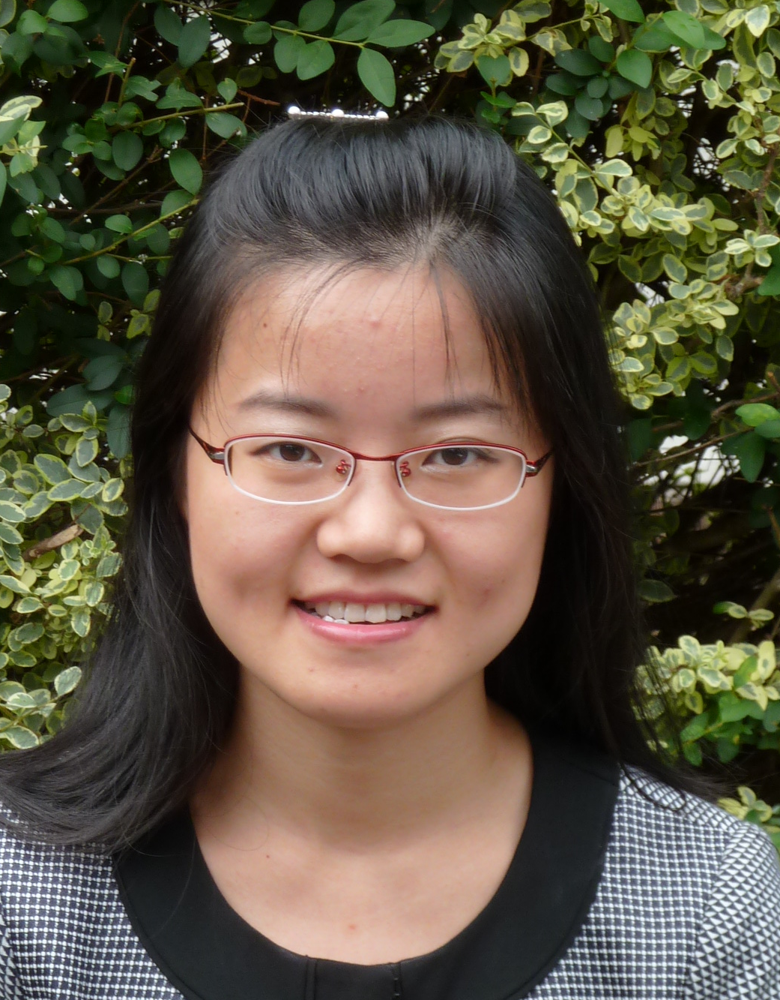

# Yi (Grace) Wang's Homepage
---

|{:height="160px"} |           | #### Yi (Grace) Wang Assistant Professor Department of Mathematics California State University Dominguez Hills Email: ywang@csudh.edu |

My research interests lie in computational harmonic analysis, machine learning,
signal and image processing and their applications to real data. 
In particular, I am interested in analyzing data lying (locally) around some low-dimensional
linear subspace and time-dependent signals (especially medical signals).
